---
## Front matter
title: "Лабораторная работа №5"
subtitle: "Архитекрура вычислительных систем"
author: "Касымова Эллина"

## Generic otions
lang: ru-RU
toc-title: "Содержание"

## Bibliography
bibliography: bib/cite.bib
csl: pandoc/csl/gost-r-7-0-5-2008-numeric.csl

## Pdf output format
toc: true # Table of contents
toc-depth: 2
lof: true # List of figures
lot: true # List of tables
fontsize: 12pt
linestretch: 1.5
papersize: a4
documentclass: scrreprt
## I18n polyglossia
polyglossia-lang:
  name: russian
  options:
	- spelling=modern
	- babelshorthands=true
polyglossia-otherlangs:
  name: english
## I18n babel
babel-lang: russian
babel-otherlangs: english
## Fonts
mainfont: PT Serif
romanfont: PT Serif
sansfont: PT Sans
monofont: PT Mono
mainfontoptions: Ligatures=TeX
romanfontoptions: Ligatures=TeX
sansfontoptions: Ligatures=TeX,Scale=MatchLowercase
monofontoptions: Scale=MatchLowercase,Scale=0.9
## Biblatex
biblatex: true
biblio-style: "gost-numeric"
biblatexoptions:
  - parentracker=true
  - backend=biber
  - hyperref=auto
  - language=auto
  - autolang=other*
  - citestyle=gost-numeric
## Pandoc-crossref LaTeX customization
figureTitle: "Рис."
tableTitle: "Таблица"
listingTitle: "Листинг"
lofTitle: "Список иллюстраций"
lotTitle: "Список таблиц"
lolTitle: "Листинги"
## Misc options
indent: true
header-includes:
  - \usepackage{indentfirst}
  - \usepackage{float} # keep figures where there are in the text
  - \floatplacement{figure}{H} # keep figures where there are in the text
---

# Цель работы

Приобрести практические навыки работы в Midnight Commander. Освоить
инструкции языка ассемблера mov и int.

Цель данного шаблона --- максимально упростить подготовку отчётов по
лабораторным работам.  Модифицируя данный шаблон, студенты смогут без
труда подготовить отчёт по лабораторным работам, а также познакомиться
с основными возможностями разметки Markdown.

# Задание

1. Создайте копию файла lab6-1.asm. Внесите изменения в программу (без
использования внешнего файла in_out.asm), так чтобы она работала по
следующему алгоритму:
• вывести приглашение типа “Введите строку:”;
• ввести строку с клавиатуры;
• вывести введённую строку на экран.
82 Демидова А. В.
Архитектура ЭВМ
2. Получите исполняемый файл и проверьте его работу. На приглашение
ввести строку введите свою фамилию.
3. Создайте копию файла lab6-2.asm. Исправьте текст программы с исполь-
зование подпрограмм из внешнего файла in_out.asm, так чтобы она ра-
ботала по следующему алгоритму:
• вывести приглашение типа “Введите строку:”;
• ввести строку с клавиатуры;
• вывести введённую строку на экран.
Не забудьте, подключаемый файл in_out.asm должен лежать в том же
каталоге, что и файл с программой, в которой он используется.
4. Создайте исполняемый файл и проверьте его работу.

# Теоретическое введение

Здесь описываются теоретические аспекты, связанные с выполнением работы.

Например, в табл. [-@tbl:std-dir] приведено краткое описание стандартных каталогов Unix.

: Описание некоторых каталогов файловой системы GNU Linux {#tbl:std-dir}

| Имя каталога | Описание каталога                                                                                                          |
|--------------|----------------------------------------------------------------------------------------------------------------------------|
| `/`          | Корневая директория, содержащая всю файловую                                                                               |
| `/bin `      | Основные системные утилиты, необходимые как в однопользовательском режиме, так и при обычной работе всем пользователям     |
| `/etc`       | Общесистемные конфигурационные файлы и файлы конфигурации установленных программ                                           |
| `/home`      | Содержит домашние директории пользователей, которые, в свою очередь, содержат персональные настройки и данные пользователя |
| `/media`     | Точки монтирования для сменных носителей                                                                                   |
| `/root`      | Домашняя директория пользователя  `root`                                                                                   |
| `/tmp`       | Временные файлы                                                                                                            |
| `/usr`       | Вторичная иерархия для данных пользователя                                                                                 |

Более подробно об Unix см. в [@gnu-doc:bash;@newham:2005:bash;@zarrelli:2017:bash;@robbins:2013:bash;@tannenbaum:arch-pc:ru;@tannenbaum:modern-os:ru].

# Выполнение лабораторной работы

1)Создаю новый каталог в  Midnight Commander.

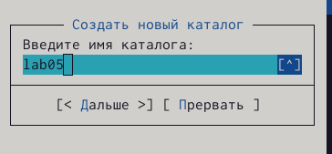{ #fig:001 width=90% }

2)Пользуясь строкой ввода и командой touch создаю файл lab5-1.asm

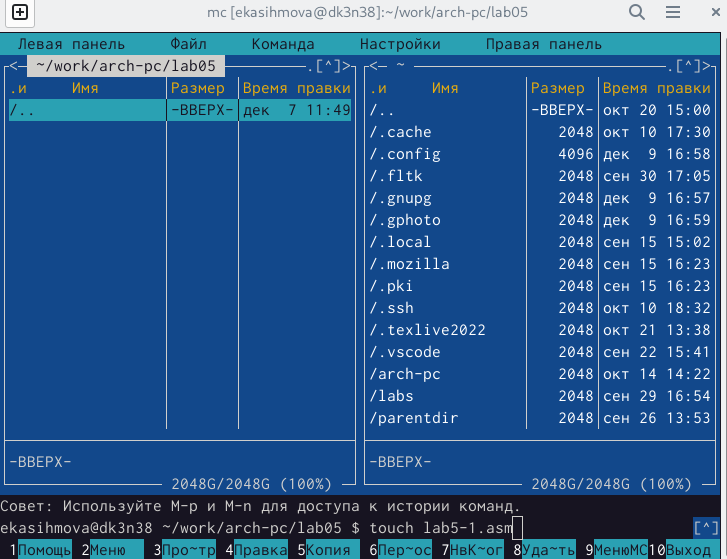{ #fig:002 width=90% }

3)С помощью функциональной клавиши F4 открываю файл lab5-1.asm для редактирования во встроенном редакторе. 

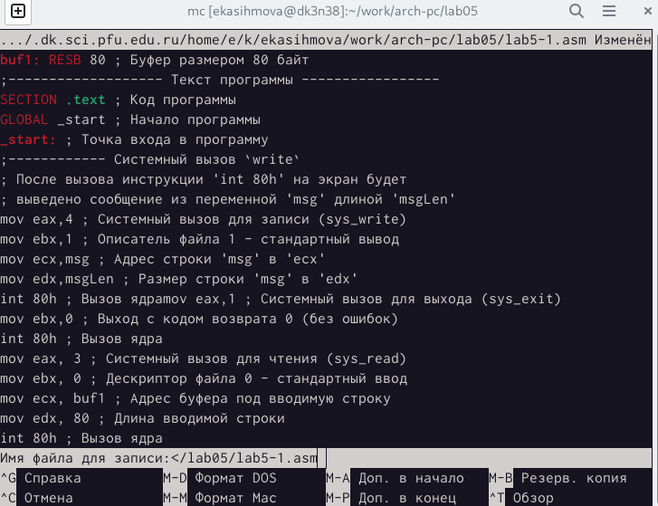{ #fig:003 width=90% }

4)Оттранслировала текст программы lab5-1.asm в объектный файл. Выполняю компоновку объектного файла и запускаю получившийся исполняемый
файл. Программа выводит строку 'Введите строку:' и ожидает ввода с
клавиатуры. На запрос ввожу ФИО.

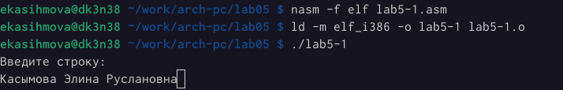{ #fig:004 width=90% }

5)В одной из панелей mc открыла каталог с файлом lab5-1.asm. В другой панели
каталог со скаченным файлом in_out.asm. Скопировала файл in_out.asm в каталог с файлом lab5-1.asm с помощью функциональной клавиши F5.

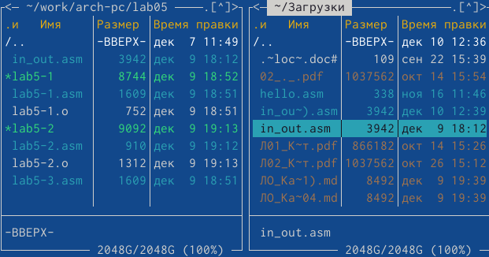{ #fig:005 width=90% }

6)Изменяю содержимое lab5-2.

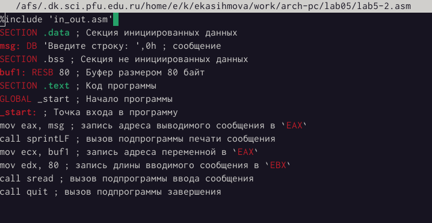{ #fig:006 width=90% }

7)В файле lab5-2.asm заменяю подпрограмму sprintLF на sprint. Создаю исполняемый файл и проверяю его работу.

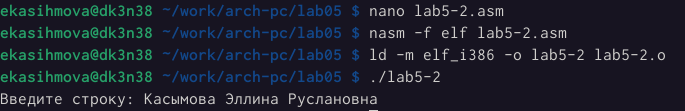{ #fig:008 width=90% }

Самостоятельная работа.
1)Создание копии файла lab5-1.asm. 

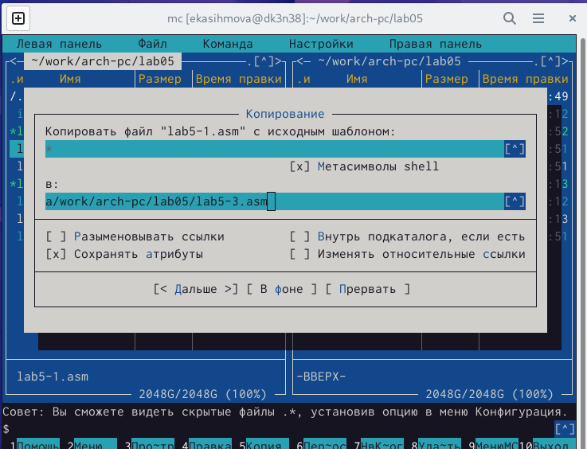{ #fig:009 width=90% }

2)Вношу изменения в программу(без использования внешнего файла из туиса).

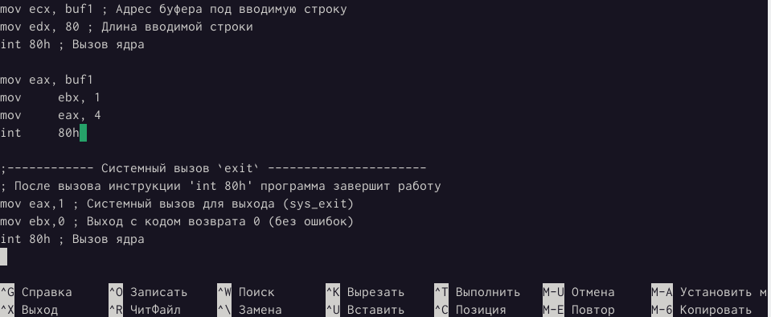{ #fig:010 width=90% }

3)Ввожу приглашение типа “Введите строку:”, ввожу строку с клавиатуры, вывожу введённую строку на экран.

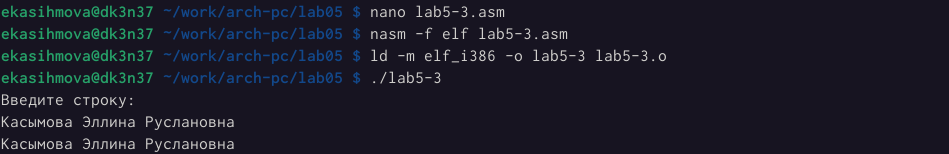{ #fig:011 width=90% }

4)Создаю копию файла lab6-2.asm.

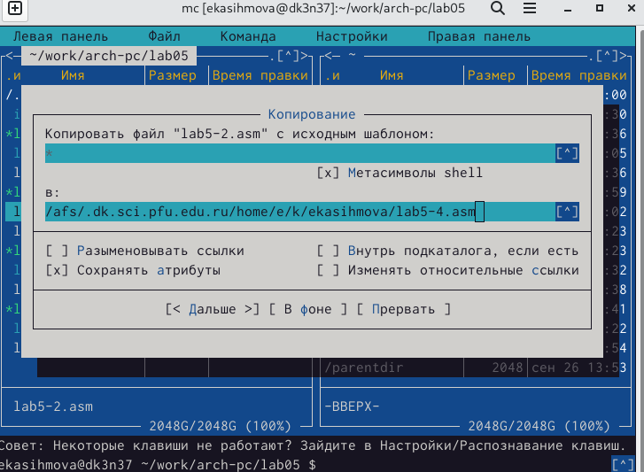{ #fig:012 width=90% }

5)Исправляю текст программы с использованием подпрограмм из внешнего файла in_out.asm.

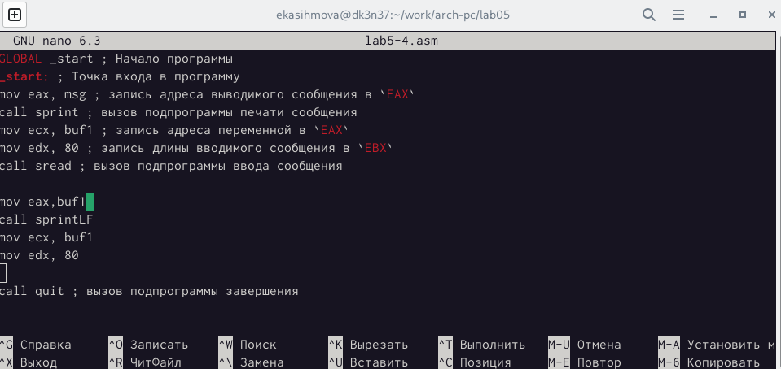{ #fig:013 width=90% }

6)Ввщжу приглашение типа “Введите строку:”, ввожу строку с клавиатуры, вывожу введённую строку на экран.

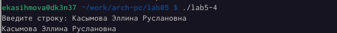{ #fig:014 width=90% }

# Выводы

Проделав данную лабораторную работу я преобрела практические навыки работы в Midnight Commander. Освоила инструкции языка ассемблера mov и int.

# Список литературы{.unnumbered}

::: {#refs}
:::
