---
## Front matter
title: "Лабораторная работа № 6"
subtitle: "Архитектура вычислительных систем"
author: "Касымова Эллина"

## Generic otions
lang: ru-RU
toc-title: "Содержание"

## Bibliography
bibliography: bib/cite.bib
csl: pandoc/csl/gost-r-7-0-5-2008-numeric.csl

## Pdf output format
toc: true # Table of contents
toc-depth: 2
lof: true # List of figures
lot: true # List of tables
fontsize: 12pt
linestretch: 1.5
papersize: a4
documentclass: scrreprt
## I18n polyglossia
polyglossia-lang:
  name: russian
  options:
	- spelling=modern
	- babelshorthands=true
polyglossia-otherlangs:
  name: english
## I18n babel
babel-lang: russian
babel-otherlangs: english
## Fonts
mainfont: PT Serif
romanfont: PT Serif
sansfont: PT Sans
monofont: PT Mono
mainfontoptions: Ligatures=TeX
romanfontoptions: Ligatures=TeX
sansfontoptions: Ligatures=TeX,Scale=MatchLowercase
monofontoptions: Scale=MatchLowercase,Scale=0.9
## Biblatex
biblatex: true
biblio-style: "gost-numeric"
biblatexoptions:
  - parentracker=true
  - backend=biber
  - hyperref=auto
  - language=auto
  - autolang=other*
  - citestyle=gost-numeric
## Pandoc-crossref LaTeX customization
figureTitle: "Рис."
tableTitle: "Таблица"
listingTitle: "Листинг"
lofTitle: "Список иллюстраций"
lotTitle: "Список таблиц"
lolTitle: "Листинги"
## Misc options
indent: true
header-includes:
  - \usepackage{indentfirst}
  - \usepackage{float} # keep figures where there are in the text
  - \floatplacement{figure}{H} # keep figures where there are in the text
---

# Цель работы

Освоение арифметических инструкций языка ассемблера NASM.

Цель данного шаблона --- максимально упростить подготовку отчётов по
лабораторным работам.  Модифицируя данный шаблон, студенты смогут без
труда подготовить отчёт по лабораторным работам, а также познакомиться
с основными возможностями разметки Markdown.

# Задание

Написать программу вычисления выражения 𝑦 = 𝑓(𝑥). Программа должна
выводить выражение для вычисления, выводить запрос на ввод значения
𝑥, вычислять заданное выражение в зависимости от введенного 𝑥, выво-
дить результат вычислений. Вид функции 𝑓(𝑥) выбрать из таблицы 6.3
вариантов заданий в соответствии с номером полученным при выполне-
нии лабораторной работы. Создайте исполняемый файл и проверьте его
работу для значений 𝑥1 и 𝑥2 из 6.3.

# Теоретическое введение

Здесь описываются теоретические аспекты, связанные с выполнением работы.

Например, в табл. [-@tbl:std-dir] приведено краткое описание стандартных каталогов Unix.

: Описание некоторых каталогов файловой системы GNU Linux {#tbl:std-dir}

| Имя каталога | Описание каталога                                                                                                          |
|--------------|----------------------------------------------------------------------------------------------------------------------------|
| `/`          | Корневая директория, содержащая всю файловую                                                                               |
| `/bin `      | Основные системные утилиты, необходимые как в однопользовательском режиме, так и при обычной работе всем пользователям     |
| `/etc`       | Общесистемные конфигурационные файлы и файлы конфигурации установленных программ                                           |
| `/home`      | Содержит домашние директории пользователей, которые, в свою очередь, содержат персональные настройки и данные пользователя |
| `/media`     | Точки монтирования для сменных носителей                                                                                   |
| `/root`      | Домашняя директория пользователя  `root`                                                                                   |
| `/tmp`       | Временные файлы                                                                                                            |
| `/usr`       | Вторичная иерархия для данных пользователя                                                                                 |

Более подробно об Unix см. в [@gnu-doc:bash;@newham:2005:bash;@zarrelli:2017:bash;@robbins:2013:bash;@tannenbaum:arch-pc:ru;@tannenbaum:modern-os:ru].

# Выполнение лабораторной работы

1)Создаю каталог для программам лабораторной работы № 6, перехожу в
него и создаю файл lab6-1.asm.

{ #fig:001 width=90% }

2)Ввожу в файл lab6-1.asm текст программы из листинга. 

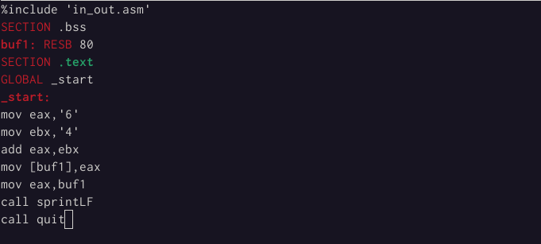{ #fig:002 width=90% }

3)Копирую файл in_out.

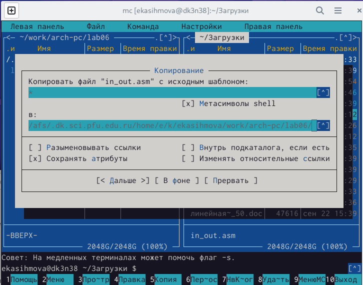{ #fig:003 width=90% }

4)Создаю исполняемый файл и запускаю его.

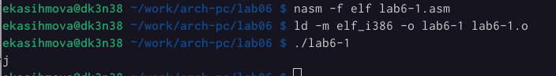{ #fig:004 width=90% }

5)Далее изменяю текст программы и вместо символов, записываю в регистры числа. Исправляю текст программы.

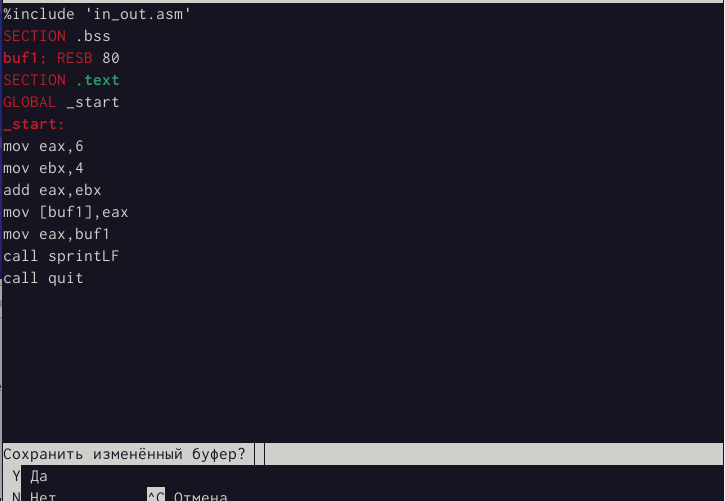{ #fig:005 width=90% }

6)Создаю файл lab6-2.asm в каталоге ~/work/arch-pc/lab06.

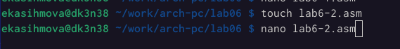{ #fig:006 width=90% }

7)Ввожу в него текст программы из листинга.

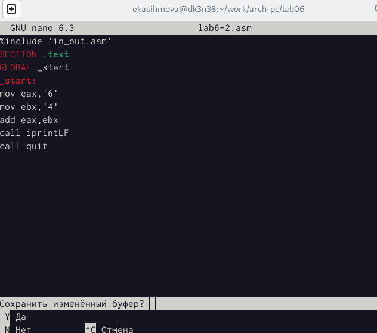{ #fig:007 width=90% }

8)Создаю исполняемый файл и запускаю его.

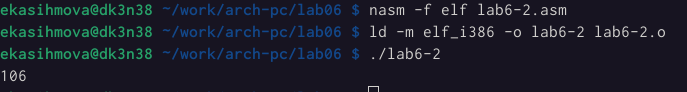{ #fig:008 width=90% }

9)Аналогично предыдущему примеру изменяю символы на числа. Заменяю строки.

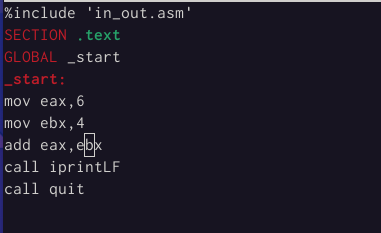{ #fig:009 width=90% }

10)Создаю исполняемый файл и запускаю его. При исполнении программы выводит результат 10.

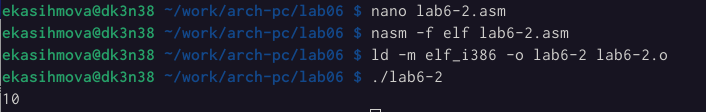{ #fig:010 width=90% }
 
11)В качестве примера выполнения арифметических операций в NASM приведем программу вычисления арифметического выражения 𝑓(𝑥) = (5 ∗ 2 +
3)/3.Создаю файл lab6-3.asm в каталоге ~/work/arch-pc/lab06.

{ #fig:011 width=90% }

12)Внимательно изучив текст программы из листинга, ввожу в lab6-3.asm.

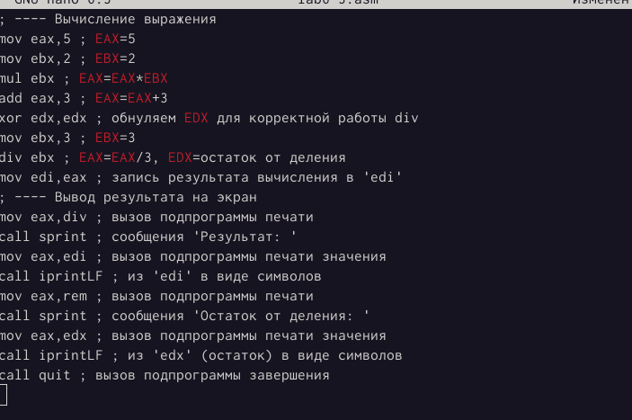{ #fig:012 width=90% }

13)Создаю исполняемый файл и запускаю его. Результат работы программы 4 и остаток от деления 1.

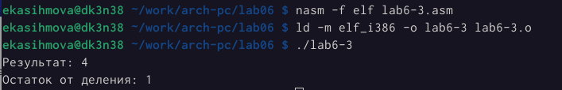{ #fig:013 width=90% }

14)Изменяю текст программы для вычисления выражения 𝑓(𝑥) = (4 ∗ 6 + 2)/5.

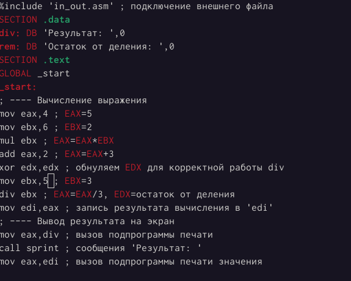{ #fig:014 width=90% }

15)Создаю исполняемый файл и запускаю его. Результат работы программы 5 и остаток от деления 1.

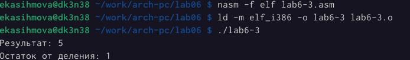{ #fig:015 width=90% }

16)Создаю файл variant.asm в каталоге ~/work/arch-pc/lab06.

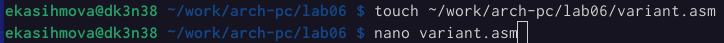{ #fig:016 width=90% }

17)Внимательно изучив текст программы из листинга, ввожу в файл
variant.asm.

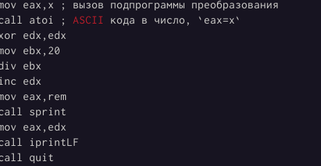{ #fig:017 width=90% }

18)Создаю исполняемый файл и запускаю его.

{ #fig:018 width=90% }

Ответы на вопросы: 

1)mov eax,rem отвечают за вывод на экран сообщения ‘Ваш
вариант:’.

2)nasm mov ecx,x - адрес строки "x" в "ecx", mov edx, 80 - размер , call sread-ввод сообщения с клавиатуры.

3)call atoi-функция преобразует ascii-код символа в целое число и записает
результат в регистр eax.

4)xor edx,edx- вычисление варианта.

5)div ebx-регистр AH.

6)inc edx- увеличивает регистр на 1.

7)call iprintLF-вывод на экран.

Самостоятельная работа.

1)Создаю файл lab6-4.asm в каталоге ~/work/arch-pc/lab06.Вычисление арифметического выражения (10 + 2𝑥)/3.

{ #fig:019 width=90% }

2)Ввожу в файл lab6-4.asm текст программы из листинга.

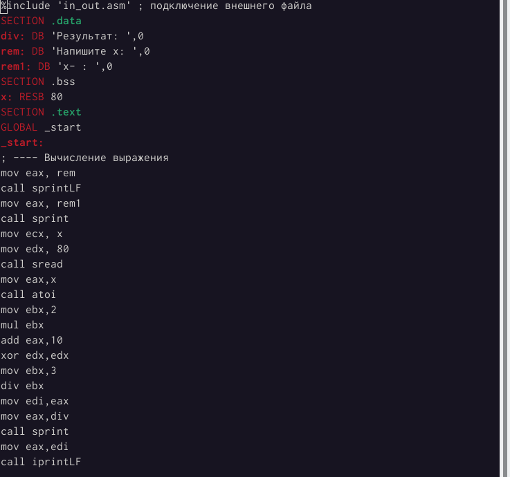{ #fig:020 width=90% }

3)Создаю исполняемый файл и запускаю его.

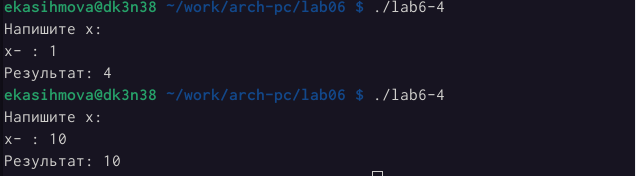{ #fig:021 width=90% }

# Выводы

Проделав данную лабораторную работу, я освоила  арифметические инструкции языка ассемблера NASM.

# Список литературы{.unnumbered}

::: {#refs}
:::
